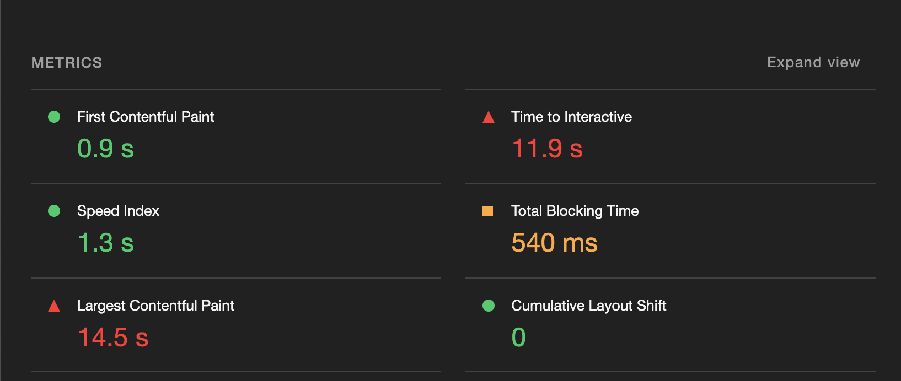
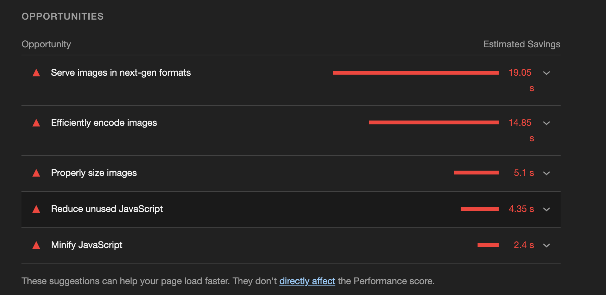
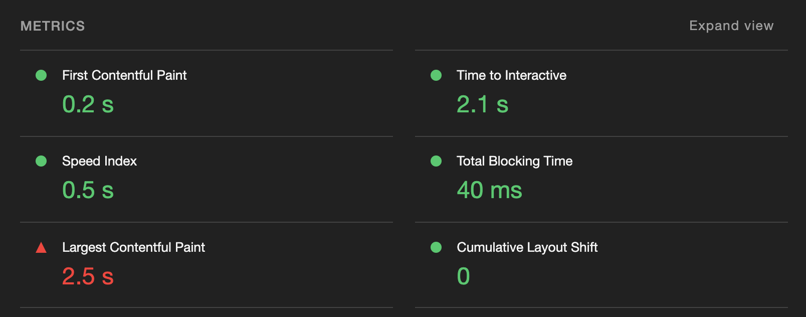
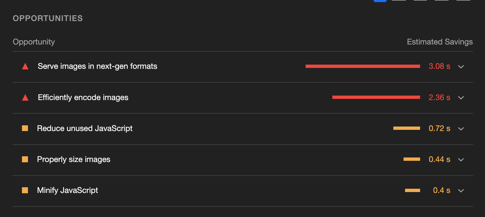

## QUESTIONS

1 - height of each section: the heights vary between sections, what's the best way to calculate them? Fit everything within a set viewport (vh100), or based on spacing between section content?

## TASKS

1 - make tablet responsive - DONE
2 - make mobile responsive - DONE
3 - correct alt tags 
4 - global styles (colors, fonts, queries)
5 - add code to change img file depending on screen size (srcset)
6 - report web vitals - lighthouse score (DONE - Initial)
7 - Documentation (Readme)
8 - Comment code
9 - refactor code
10 - Deploy site - DONE

## DEPLOYED SITE

https://inov8lw.netlify.app/ 

## Lighthouse Scores

### Mobile - Initial scores (once build was finished)

### Desktop - Initial scores (once build was finished)

### - lighthouse: moving forward

Performance seems to be the area of improvement, particuarly for mobile. According to the lighthouse analysis, it is largely to do with the images. 

Moving forward, I will create a react srcset for all image sizes. This should improve performance. 