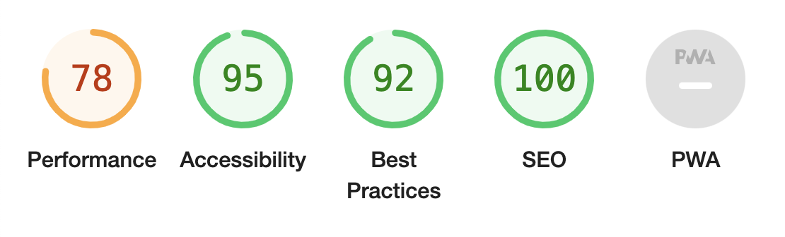
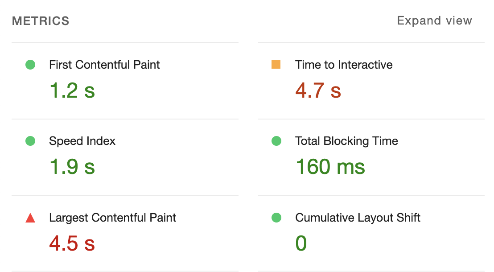
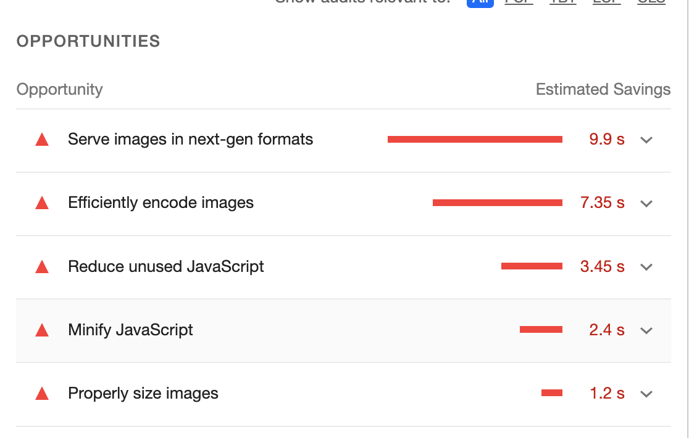
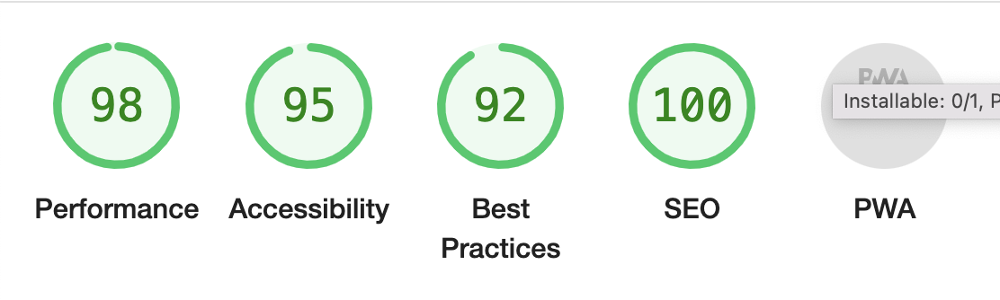
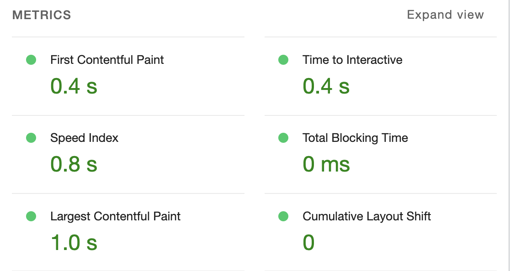
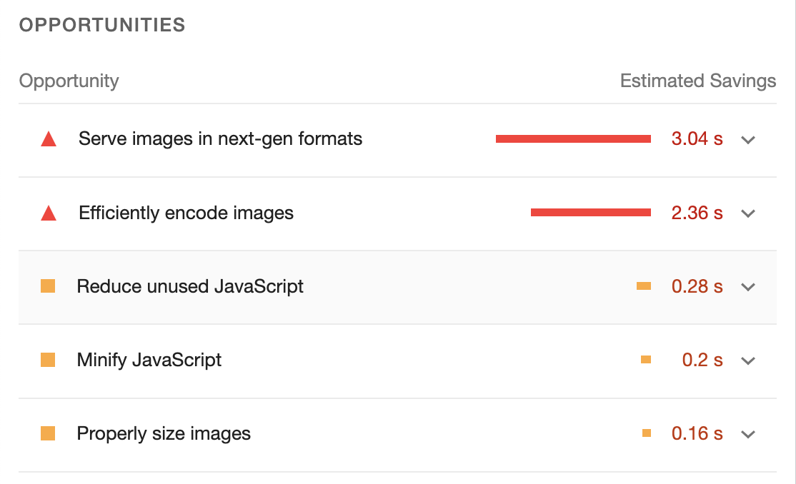

# INOV8 WEB BUILD

Welcome to the Inov8 web build. A responsive single page website built to design spec using React.js and styled components. 

It responds to Mobile, Tablet, Laptop and desktop view ports.

The key objective of this was to build a webpage according to design-spec whilst meeting the deadline.

Furthermore, it was an opportunity to get to grips with the web vitals/ lighthouse for referenc eon how the site performs.

## PROCESS

I started by analysing the design spec for desktop (1920w). 

I then broke the design into 7 key sections and set up the src/components accordingly.

Next, I built each section on order, making sub-components where necessary. For instance, Section one had a notification component, which I build as a child component and then imported it into Section one. This kept the code more tidy.

Once all 7 sections were built for  desktop (1920w), I went though each section again to make the sizes responsive between desktop (1920w) and desktop (1280w). I'd use the designs for each desktop size as a reference.

Next I repeated the proces for tablet (768w) and then mobile (428w). 

In some cases I used custom media query break points as this enabled smoother responsivenes. For instance, in section 5, the row of 4 shoes broke naturally at 1700w to create 2 columns, and then again at 700w for one column. The breakpoint at 700w was because the buttons, according to the design remained at 300w for all devices, so I took that into account when finding the natural break point. 

After the webpage was made mobile responsive, I ran a lighthouse test to see how it performed. You can see the results for mobile and desktop below. 

## DEPLOYED SITE

<a href="https://inov8lw.netlify.app/">Click Here!</a>

## DESIGN SPEC

<a href="https://xd.adobe.com/view/cc93ae62-3c05-4b51-bf7a-f35a8af2038d-99c0/specs/">Desktop 1920w</a>

<a href="https://xd.adobe.com/view/84ffd34b-8d2b-4bae-968f-589a61fbfdb1-d1ac/">Desktop 1280w</a>

<a href="https://xd.adobe.com/view/65ed8046-632c-4e64-8570-5a6884dec412-30be/">Tablet 768w</a>

<a href="https://xd.adobe.com/view/3c173307-3414-443b-b899-ec82c6b24ef7-6944/">Mobile 428w</a>


## Lighthouse Scores

### Mobile - Initial scores (once build was finished)


### Desktop - Initial scores (once build was finished)


### - lighthouse: moving forward

Performance seems to be the area of improvement, particuarly for mobile. According to the lighthouse analysis, it is largely to do with the images. 

Moving forward, I will create a react srcset for all image sizes. This should improve performance.

I would also look into the other opportunities and work to resolve them one by one.

###  srcSet attempt

I tried implementing the srcSet attribute on the header image in section one as followed:

```
    srcSet="/assets/desktop/header.jpg 1920w, /assets/tablet/header.jpg 768w, /assets/mobile/header.jpg 428w "

    sizes="(max-width 428px) 100vw, (max-width 768px) 100vw, (max-width 1950px) 100vw"
```

I didn't manage to get it to work. So this will be something I look into in the future to help improve performance. 

For now I will use conditional rendering media queries to display images based on device size.

## FUTURE MOVES

In addition to improving the lighthouse analysis, there are a few other things I would account for:

- Refactoring the code, for instance section 5 I conditionally rendered 2 different displays depending on screen width. I could make sub components for each (mobile / tabletAndDesktop) and then import them into the section 5 jsx. This would keep the section 5 page cleaner.

- Dynamic global values for fonts, colors & media queries
  - This would have kept the code cleaner and more dynamic

- Impove webiste build, based off feedback. (best practices)


## SECOND LIGHTHOUSE ANALYSIS

Having implemented conditional image rendering for device sizes as a quick solution to the slow image performance upon page load, I carried out another lighthouse analysis. The results for both mobile and desktop have improved and look positive.

### Mobile 





### Desktop





Moving forwards, looking into serving images in next gen format could be a way to further improver the performance, particuarly for mobile.

